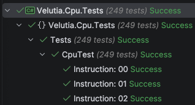

# Velutia

An instruction-level accurate [MOS 6502](https://en.wikipedia.org/wiki/MOS_Technology_6502) CPU emulator written in C# (.NET 10).

## Features

- Supports all 256 documented & undocumented instructions from the [6502 instruction set](https://www.masswerk.at/6502/6502_instruction_set.html).
- Passes all of Tom Harte's 6502 [Single Step Tests](https://github.com/SingleStepTests/65x02/tree/main/6502#6502).
- Instruction-level accuracy.
- Implemented as a .NET library which can easily be integrated into a system emulation project.

## Usage

To use the emulator, simply download the project and reference `Velutia.Cpu.csproj` in your project. 

## Testing

To run the tests, open the `Velutia.Cpu.Tests` project and run it. NUnit will run 249 instruction tests, and each test will execute the 10,000 single step tests associated with that instruction:

### Note

Because seven of the undocumented instructions are inherently unstable, their tests are not run. They include:

- ANE
- LXA
- SHA (Abs, y & Ind, Y)
- SHX
- SHY
- TAS